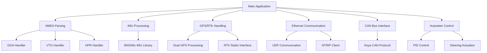
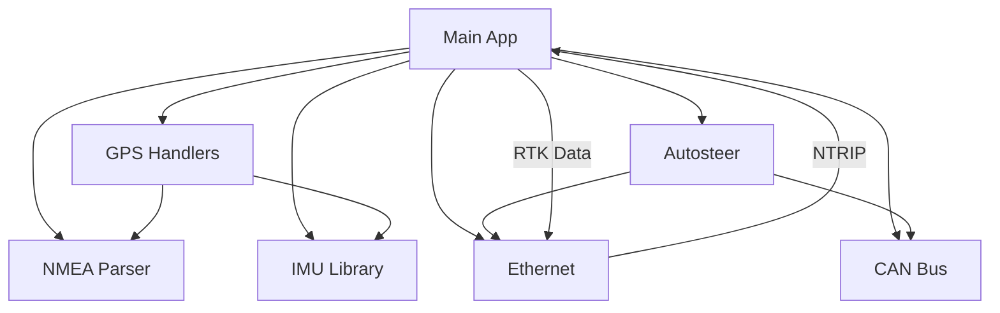

# AW KeyaTwinTrack Project Overview

## Project Description

The AW KeyaTwinTrack project is an advanced agricultural guidance and autosteer system built for integration with AgOpenGPS. It's designed to run on a Teensy 4.1 microcontroller and provides dual GPS/RTK positioning, IMU sensor fusion, CAN bus communication with Keya steering systems, and Ethernet networking capabilities. The system supports both single and dual antenna configurations for precise vehicle positioning and heading determination.

## System Architecture

## Core Modules

### 1. Main Application (_AW_KeyaTwinTrack.ino)

This is the primary entry point of the system that initializes all subsystems and manages the main execution loop.

#### Key Responsibilities:
- System initialization and setup
- Main execution loop coordination
- GPS/RTK data routing
- Dual antenna processing
- IMU integration
- Ethernet networking management

#### Key Functions:
- `setup()` - Initializes all system components
- `loop()` - Main execution loop
- `calcChecksum()` - Validates incoming data packets

#### Dependencies:
- [BNO08x_AOG Library](#3-imu-processing-module-bno08x_aogcpp--bno08x_aogh)
- [NMEA Parser](#2-nmea-parsing-module-znmeaparserh)
- [GPS Handlers](#4-gps-data-handling-module-zhandlersino)
- [Ethernet Communication](#5-ethernet-communication-module-zethernetino)
- [CAN Bus Interface](#6-can-bus-interface-module-zcanbusino)
- [Autosteer Control](#7-autosteer-control-module-autosteerino)

### 2. NMEA Parsing Module (zNMEAParser.h)

Handles parsing of NMEA sentences from GPS receivers.

#### Key Responsibilities:
- Parsing of standard NMEA sentences (GGA, VTG, HPR)
- Error handling for malformed sentences
- Argument extraction from NMEA strings

#### Key Functions:
- `NMEAParser::parseInputReport()` - Processes incoming NMEA data
- `NMEAParser::parseCommandReport()` - Handles command responses
- Various error handling functions

#### Dependencies:
- Arduino framework
- Standard C++ libraries

### 3. IMU Processing Module (BNO08x_AOG.cpp / BNO08x_AOG.h)

Manages the BNO08x inertial measurement unit for orientation sensing.

#### Key Responsibilities:
- IMU initialization and configuration
- Sensor data acquisition (accelerometer, gyroscope, magnetometer)
- Quaternion-based orientation calculations
- Game rotation vector processing

#### Key Functions:
- `BNO080::begin()` - Initializes the IMU
- `BNO080::dataAvailable()` - Checks for new sensor data
- `BNO080::getQuat()` - Retrieves quaternion orientation
- `BNO080::enableGameRotationVector()` - Enables rotation vector reports

#### Dependencies:
- Arduino Wire library (I2C communication)
- SPI library (for SPI-connected IMUs)

### 4. GPS Data Handling Module (zHandlers.ino)

Processes incoming GPS data and manages the fusion of GPS and IMU information.

#### Key Responsibilities:
- NMEA sentence handling (GGA, VTG, HPR)
- GPS/IMU data fusion for improved heading accuracy
- Heading rate calculations
- Wheel angle estimation from GPS data

#### Key Functions:
- `GGA_Handler()` - Processes GGA sentences
- `VTG_Handler()` - Processes VTG sentences
- `HPR_Handler()` - Processes HPR (heading/pitch/roll) sentences
- `imuHandler()` - Fuses IMU and GPS data
- `readBNO()` - Reads IMU sensor data

#### Dependencies:
- [NMEA Parser](#2-nmea-parsing-module-znmeaparserh)
- [BNO08x Library](#3-imu-processing-module-bno08x_aogcpp--bno08x_aogh)

### 5. Ethernet Communication Module (zEthernet.ino)

Manages network communication with AgOpenGPS via UDP.

#### Key Responsibilities:
- Ethernet initialization
- UDP packet transmission and reception
- NTRIP client functionality for RTK corrections
- Auto-steer data exchange

#### Key Functions:
- `EthernetStart()` - Initializes Ethernet connection
- `ReceiveUdp()` - Handles incoming UDP packets
- `sendUdpData()` - Transmits UDP packets
- NTRIP data handling functions

#### Dependencies:
- NativeEthernet library
- NativeEthernetUDP library

### 6. CAN Bus Interface Module (zCANBUS.ino)

Handles communication with Keya steering systems over CAN bus.

#### Key Responsibilities:
- CAN bus initialization
- Keya protocol implementation
- Steering position and status monitoring
- Fault detection and reporting

#### Key Functions:
- `CAN_Setup()` - Initializes CAN bus
- `KeyaBus_Receive()` - Processes incoming CAN messages
- `degreesToPosition()` - Converts steering angles to position units
- `positionToDegrees()` - Converts position units to steering angles

#### Dependencies:
- FlexCAN_T4 library
- CAN message structures

### 7. Autosteer Control Module (Autosteer.ino)

Implements the automatic steering control system.

#### Key Responsibilities:
- PID-based steering control
- PWM signal generation for steering actuators
- Steering wheel encoder processing
- EEPROM configuration storage
- Safety monitoring and watchdog functionality

#### Key Functions:
- `autosteerSetup()` - Initializes autosteer system
- `autosteerLoop()` - Main autosteer control loop
- PID control calculations
- PWM output generation
- EEPROM configuration management

#### Dependencies:
- Wire library (I2C)
- EEPROM library
- NativeEthernet libraries

## System Interdependencies

## Data Flow

1. **GPS/RTK Data Ingestion**: Raw NMEA sentences are received from one or two GPS receivers
2. **Data Parsing**: NMEA parser extracts relevant information from sentences
3. **Sensor Fusion**: GPS data is combined with IMU data for improved accuracy
4. **Network Communication**: Processed data is sent to AgOpenGPS via Ethernet/UDP
5. **Steering Control**: Autosteer module receives commands from AgOpenGPS and controls the steering actuator
6. **CAN Bus Interface**: Communication with Keya steering systems for position feedback and control

## Configuration and Settings

The system uses EEPROM storage for configuration parameters:
- PID control gains
- PWM settings
- Sensor calibration values
- Network configuration
- Steering system parameters

## Hardware Interfaces

- **Serial Ports**: Multiple hardware serial interfaces for GPS receivers and RTK radios
- **I2C**: IMU communication
- **CAN Bus**: Keya steering system interface
- **Ethernet**: Communication with AgOpenGPS
- **Digital I/O**: LED indicators, switches, PWM outputs

## Key Features

- **Dual Antenna Support**: High-precision heading determination using two GPS antennas
- **IMU Integration**: Sensor fusion for improved orientation accuracy
- **RTK Support**: Centimeter-level positioning accuracy
- **CAN Bus Interface**: Direct communication with Keya steering systems
- **Ethernet Networking**: UDP-based communication with AgOpenGPS
- **PID Control**: Precise steering control with configurable parameters
- **Safety Monitoring**: Watchdog timers and fault detection